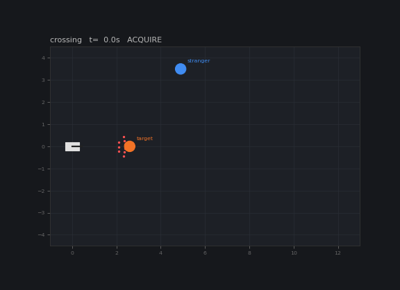
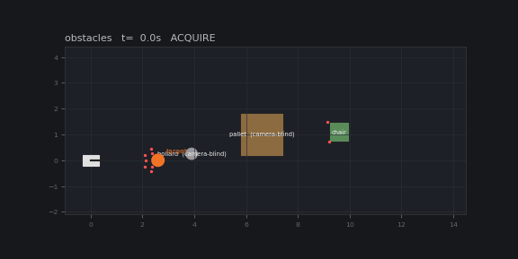
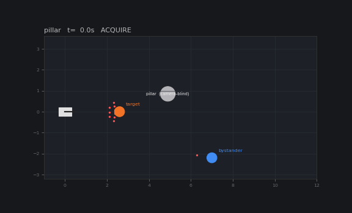

# followme-bot

Person-following for a small ground robot. It locks onto one person, stays
about 2.6 m behind them, steers around obstacles, and keeps track of who it
is following when other people walk through the frame.

The repo has the brain (`followme/`), a 2-D simulator with test scenarios
(`simkit/`), a ROS 2 package, and the code for running it on my rover: a
Raspberry Pi 4 driving four motors, with a laptop running YOLO over Wi-Fi.

| Look-alike crosses in front | Around furniture | Behind a pillar |
|:---:|:---:|:---:|
|  |  |  |
| Someone in similar clothes stops in front of the target and the tracker gives them the target's ID. The swap gets caught and the right person is picked up again. | The straight line to the person goes through a pallet and a chair. The pallet isn't a YOLO class, so only the ultrasonics see it. | The person disappears behind a pillar. The rover drives to where it last saw them and re-identifies them when they come out. |

## What it does

- Locks onto one person and follows at a set distance. Stops when they stop.
- Remembers what they look like (colour histograms of torso and legs),
  catches tracker ID swaps, and re-identifies them after they've been out of
  sight. It won't start following someone else unless you re-lock it.
- Avoids obstacles from the ultrasonics (or a lidar) and anything YOLO can
  label: chairs, bags, other people. Obstacles are remembered for a few
  seconds so a corner doesn't disappear once it leaves the sensor cone.
- When the person is lost, it drives to where they were last seen (if they
  vanished behind something) or turns toward the side they left on. If that
  doesn't find them, it stops and waits.
- Two drive profiles on the same brain: `hardware` for a skid-steer that
  can't turn gently from rest (stiction kick, duty floors, ~250 ms latency),
  and `ideal` for perfect motors.

## Quick start (simulator, no robot needed)

```bash
git clone https://github.com/vedantparnaik/followme-bot.git && cd followme-bot
python -m venv .venv && source .venv/bin/activate
pip install -e ".[dev]"

python -m simkit.run                          # every scenario, headless, ~2 s
python -m simkit.run -s crossing -v           # one scenario with its event log
python -m simkit.run --sensor lidar --seeds 4
python -m simkit.run -s pillar --gif pillar.gif
pytest                                        # unit tests + all scenarios
```

```
scenario   seed  pass  collisions  person_contacts  follow_s  wrong_s  reid  range_err_m  final
loop          0  True           0                0      45.6      0.0     0         0.41  FOLLOW@2.9m
obstacles     0  True           0                0      33.6      0.0     0         0.84  FOLLOW@2.5m
crossing      0  True           0                0      26.3      0.0     1         0.71  FOLLOW@2.6m
pillar        0  True           0                0      24.0      0.0     1         0.65  FOLLOW@2.8m
```

A run passes if there are no collisions, no contact with any person, less
than 0.5 s spent following the wrong person, and it ends locked on the right
one. Right now 32/32 runs pass on the hardware plant with sonar (8 seeds),
16/16 with lidar, and 16/16 on the ideal plant.

### ROS 2 and RViz

```bash
tools/run_ros_sim.sh                                  # obstacles, hardware, sonar
tools/run_ros_sim.sh scenario:=crossing sensor:=lidar
ros2 topic pub --once /follow/cmd std_msgs/String '{data: estop}'
ros2 topic echo /follow/state
```

Tested on ROS 2 Humble (RoboStack on macOS). The `world` node plays the
robot (detections, range, odometry) and the `brain` node runs the same
`followme.Brain`.

## On the real robot

The Pi streams the camera as MJPEG, serves odometry (and ultrasonic readings
if you have them), and takes motor commands over HTTP. The laptop runs
YOLO + ByteTrack and the brain, and sends the commands back. If the Pi
doesn't get a command for 0.25 s it stops the motors.

```bash
ssh-copy-id pi@raspberrypi.local                              # once
PI_HOST=raspberrypi.local PI_USER=pi tools/deploy_pi.sh       # PI_SONAR=1 for ultrasonics
pip install -e ".[robot]"
FOLLOWME_PI=raspberrypi.local:8000 python robot/mac/follow_server.py
```

Open http://127.0.0.1:8080/, stand in front of the camera and press ARM. It
starts disarmed, E-STOP stays latched until you reset it, and the Pi stops
the motors if the laptop or the Wi-Fi drops. Leave the speed cap at the
default 15% for the first runs.

To try the laptop side without a robot, `tools/fake_pi.py` serves a video
file as the camera:

```bash
python tools/fake_pi.py --video some_walk.mov
FOLLOWME_PI=127.0.0.1:8000 python robot/mac/follow_server.py
```

Wiring, pins and the drive layer are in [docs/hardware.md](docs/hardware.md).

## Layout

```
followme/                  the brain: perception, re-ID, tracker, obstacles, planner, state machine
simkit/                    2-D world, virtual camera and range sensors, drivetrain models, scenarios
tests/                     unit tests, plus every scenario as a test
ros2_ws/src/followme_ros/  world and brain nodes, launch file, RViz config
robot/pi/                  Pi server (camera, motors, deadman, /odom) and the HC-SR04 driver
robot/mac/                 laptop app: YOLO + ByteTrack, colour features, web UI
tools/                     deploy script, fake Pi, ROS launcher
```

How the brain works: [docs/architecture.md](docs/architecture.md).

## Limitations

- There's no map or SLAM, just a few seconds of obstacle memory. It follows
  a person along a path a person can walk; it won't find its way out of a
  maze.
- Without the ultrasonics, the only obstacles it can see are things YOLO has
  a class for. In camera-only mode the pallet, bollard and pillar scenarios
  end in collisions.
- Colour histograms tell different outfits apart, not two people dressed the
  same. The gallery takes any feature vector, so a learned re-ID model can
  replace them.
- Odometry is dead reckoning from motor duty (no encoders). Fine for a few
  seconds of memory, not for navigation.
- Sensing is front only. Nothing covers the sides or the back.
- The sim is 2-D: flat ground, cylinder people, clean geometry. The
  drivetrain model is measured from the real rover, and that's where most of
  the difficulty is, but a passing sim run doesn't guarantee the same
  outside.

## License

AGPL-3.0 ([LICENSE](LICENSE)). A commercial license is available if you want
to use it in closed-source products; see [COMMERCIAL.md](COMMERCIAL.md). The
laptop app uses Ultralytics YOLO, which has its own AGPL-3.0 license.
