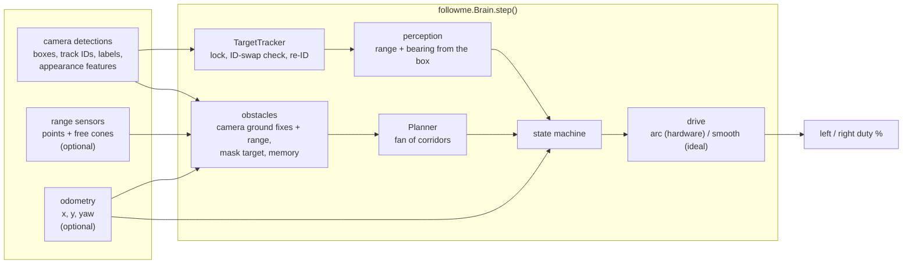
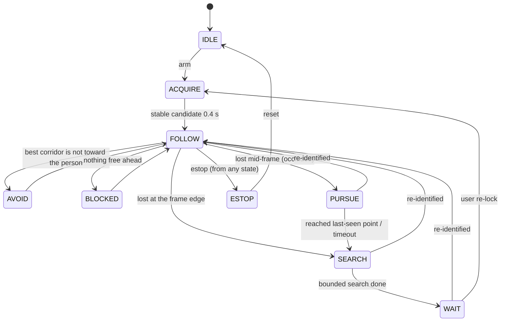

# Architecture

`followme/` is plain Python and numpy. It doesn't know whether it's running
on the robot, in ROS or in a unit test; every input is plain data with a
timestamp. The three places that feed it:

| Where | Detections from | Range from | Odometry from | Duty goes to |
|-------|-----------------|------------|---------------|--------------|
| `simkit` (headless) | `VirtualCamera` | `Sonar3` / `Lidar` rays | true pose | `HardwarePlant` / `IdealPlant` |
| `ros2_ws/followme_ros` | `world` node, `/detections` | `/range` | `/odom` | `/cmd_duty` -> `world` node |
| `robot/` | YOLO + ByteTrack on the Pi's MJPEG | Pi `/range` (HC-SR04) | Pi `/odom` (duty dead reckoning) | Pi `/cmd` |

## One step

1. Track. `TargetTracker.update()` finds the locked person by tracker ID.
   Before trusting the ID it checks whether the box jumped (range change
   over 0.6 m, or the centre moving more than 0.6 box widths, in one frame)
   and whether it still looks like them (smoothed appearance similarity
   against the gallery). If either fails, the tracker has handed the ID to
   someone else: drop it, mark that ID as someone else, and roll the
   last-seen bearing back 0.5 s.
2. Re-identify. If nothing matches, every unknown person is compared to the
   gallery (mean of the 3 best cosine similarities). A candidate has to score
   above 0.88, beat the runner-up by 0.04, and do that 5 frames in a row.
   People seen in the same frame as the target are never candidates.
3. Measure. Range comes from the box height (assuming a 1.7 m person), or
   from its width when the head or feet are cut off. Bearing comes from the
   box centre.
4. Obstacles. Range points, plus a flat-ground fix for every other detection
   (chairs, bags, other people; people get 0.35 m of padding because they
   move). The followed person is masked out. With odometry, points are kept
   for 2.5 s on a 5 cm grid, so a corner that has left the sonar cone is
   still there. A range reading that passes through a remembered point
   clears it.
5. Plan. A fan of straight corridors, each as wide as the rover plus a
   margin. Anything blocked within 0.40 m is rejected, and the rest are
   scored by how far they point away from the person and how cramped they
   are. Headings that keep the person in the camera win; a wider one is only
   used if nothing else is free. Headings the range sensors don't cover
   aren't trusted, and sharp ones also need the swing circle clear, since a
   skid-steer pivots around its centre.
6. Decide and drive. The state machine below picks what to do, and the drive
   layer turns a range error and a heading into duty. The `hardware` profile
   steers by curving while rolling and only pivots in short nudge-and-settle
   pulses, because the real drivetrain can't turn gently from rest.

## State machine

- `BLOCKED` stands still. If it's still blocked after 1.5 s and the strip
  behind is known to be free, it backs off 0.35 m to get room to turn.
- `PURSUE` drives, with avoidance, to where the person was last seen, and
  waits if another person is standing in the way. It needs odometry.
- `SEARCH` turns toward the side they left on, or the way they were walking
  if it came from `PURSUE`. It gives up after a few pulses (or a fixed angle
  with the `ideal` profile).
- `WAIT` stands still and keeps comparing everyone to the gallery.

## Profiles

`followme.config.hardware()` and `ideal()` are the same brain with different
drive and search laws. All the numbers are in `followme/config.py` with a
comment next to each. The simulator's `HardwarePlant` copies the real
rover's drive layer (0.25 s latency, 55% stiction kick, 18% / 26% duty
floors, 400%/s slew), and the `hardware` profile is tuned against it.

For what it doesn't handle, see [Limitations](../README.md#limitations).
