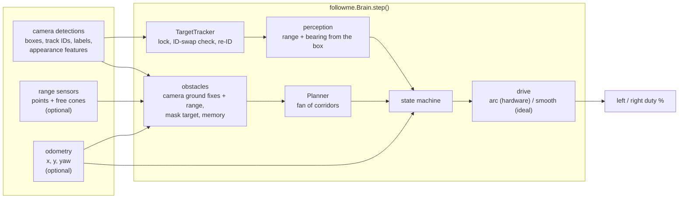
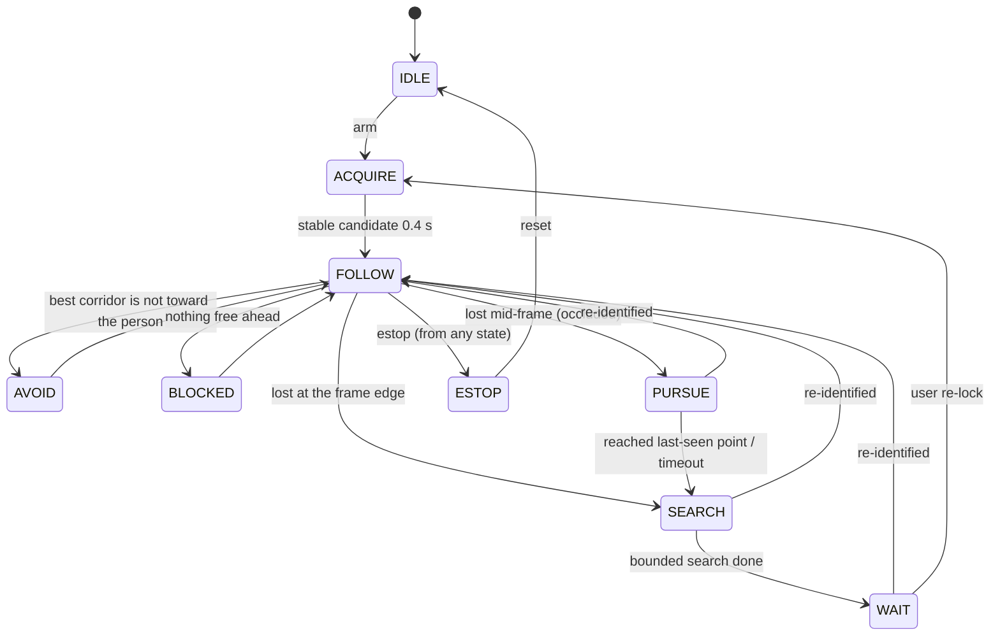

# Architecture

One brain, three ways to feed it.

`followme/` is plain Python + numpy. It has no idea whether it is on a robot,
in ROS or in a unit test: every input is plain data with a timestamp.

| Where | Detections from | Range from | Odometry from | Duty goes to |
|-------|-----------------|------------|---------------|--------------|
| `simkit` (headless) | `VirtualCamera` | `Sonar3` / `Lidar` rays | true pose | `HardwarePlant` / `IdealPlant` |
| `ros2_ws/followme_ros` | `world` node, `/detections` | `/range` | `/odom` | `/cmd_duty` -> `world` node |
| `robot/` | YOLO + ByteTrack on the Pi's MJPEG | Pi `/range` (HC-SR04) | Pi `/odom` (duty dead reckoning) | Pi `/cmd` |

## One step

1. **Track.** `TargetTracker.update()` finds the locked person by tracker ID.
   Before trusting the ID it checks two things: did the box teleport (range
   jump > 0.6 m or centre jump > 0.6 box widths in one frame), and does it
   still look like them (EMA of appearance similarity vs the gallery). Either
   failing means the tracker handed the ID to someone else: drop it, remember
   that ID as "someone else", and roll the last-seen bearing back 0.5 s.
2. **Re-identify.** With no match, every *unknown* person is compared to the
   gallery (mean of the 3 best cosine similarities). Accept only above 0.88,
   clearly ahead of the runner-up, for 5 frames in a row. People seen in the
   same frame as the target are never candidates. It never locks a stranger
   on its own.
3. **Measure.** Range from the box height (a person is ~1.7 m tall), or from
   its width when the head or feet are cut off by the frame. Bearing from the
   box centre.
4. **Obstacles.** Range points, plus a flat-ground fix for every other
   detection (chair, bag, other people; people are padded 0.35 m because they
   move). The followed person is masked out. With odometry, points are kept
   for 2.5 s on a 5 cm grid so a corner that left the sonar cone is still
   there; a range reading that now passes through a remembered point clears it.
5. **Plan.** A fan of straight corridors, rover-wide plus a margin. Reject
   anything blocked inside 0.40 m. Score the rest by angle away from the
   person plus how cramped they are. Prefer headings that keep the person in
   the camera; take a wider one only if nothing else is free. Only trust
   headings the range sensors actually cover. Sharp headings also need the
   swing circle clear (a skid-steer pivots around its centre).
6. **Decide and drive.** See the state machine below. The drive layer turns
   a range error and a heading into duty. `hardware` steers by curving while
   rolling and only pivots in short nudge-and-settle pulses, because the real
   drivetrain cannot turn gently from rest.

## State machine

- **BLOCKED** stands still. If it stays blocked for 1.5 s and the strip
  behind is known free, it backs off 0.35 m to get room to turn.
- **PURSUE** drives, with avoidance, to where the person was last seen. It
  waits instead if another person is standing in the way. Needs odometry.
- **SEARCH** turns toward the side they left on (or the way they were walking
  after PURSUE). Bounded: a few pulses, or a fixed angle in `ideal`.
- **WAIT** stands still and keeps comparing everyone to the gallery.

## Profiles

`followme.config.hardware()` and `ideal()` are the same brain with different
drive and search laws. Every number is in `followme/config.py` with the
reason next to it. The simulator's `HardwarePlant` reproduces the reference
rover's drive layer (0.25 s latency, 55 % stiction kick, 18 / 26 % duty
floors, 400 %/s slew); the `hardware` profile is tuned against it.

## What it does not do

- **No global map, no SLAM.** Memory is a few seconds of obstacles in the
  odometry frame. It will not plan through a maze; it follows a person who
  is walking a path a person can walk.
- **Camera-only obstacles are limited to what the detector knows.** A pallet,
  a low box or a glass door is invisible to a person/COCO detector. That is
  what the range sensors are for, and the camera-only scenarios with such
  obstacles fail on purpose.
- **Colour-histogram re-ID** separates a red jacket from a grey one, not two
  people in the same uniform. The gallery takes any feature vector; a
  learned embedding drops in without touching the brain.
- **Front sensing only.** Nothing covers the sides or the back.
